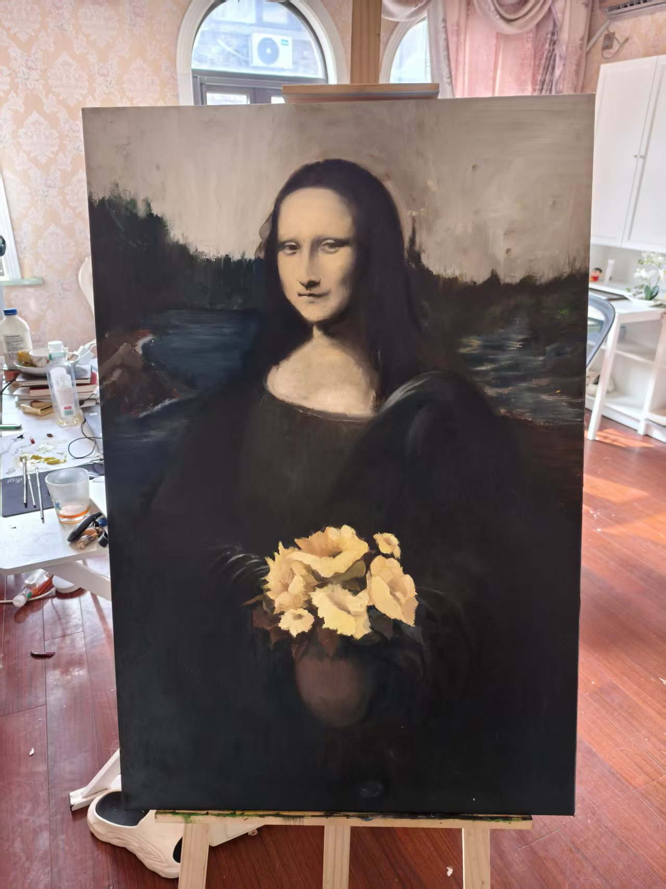
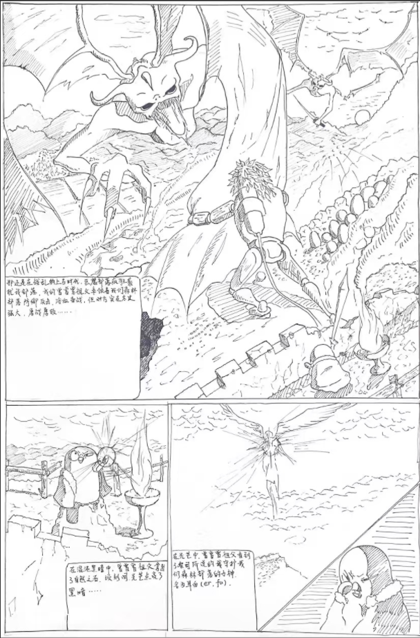
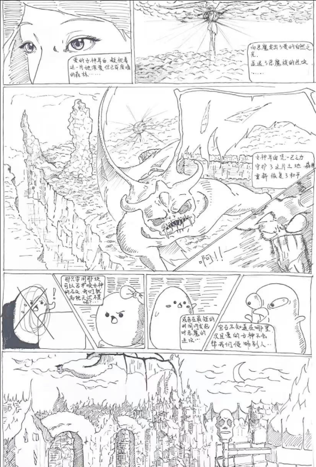

# About me

Hello, my name is Chen Chen. I previously worked as a Product Operations Specialist at Tencent, and later moved into operations management at Diplomat. Since then, I have become a freelancer — an amateur cartoonist with a passion for interesting dreams, and a content creator. I love the vibrant world of animation, and I am committed to building a kingdom of dreams and fantasies that belongs to everyone.

## My background

I hold a management degree from Sanda University and an international finance degree from Shanghai International Studies University. I studied classical fine arts for ten years and enjoy painting oils, illustrations, and sketches. I have my own serialized comic and have written short stories. I am a pragmatic doer who dreams of poetry and faraway places. Currently, I am the CEO of an AI education company, and I am now dedicated to developing AI+tech innovation business. I also hope to meet more like-minded friends to share our dreams, and I look forward to joining Fab Academy.

## My work experience

I previously worked in the User Growth Department of the QQ Operations Division at Tencent, where I was responsible for product operations of the "QQ Group Buying Snacks Fresh" business. My duties included delivering the entire H5 planning and coordinating with suppliers. On the launch day, the daily active users exceeded 1 million, and the monthly sales reached over 10 million RMB. I was also recognized as the "Monthly Star" of the User Growth Department.
I later worked at Diplomat Luggage Group as an Operations Supervisor in the Operations Department. I managed the group’s JD.com POP store, VIP.com flagship store, and other e-commerce channels. I was named Outstanding Employee of the Year, and the business I oversaw achieved annual sales of over 60 million RMB. In addition, I was responsible for content management across livestreaming, offline runway show coordination, and on-site operations for VIP.com and JD.com.
## My Project
121212121121212

