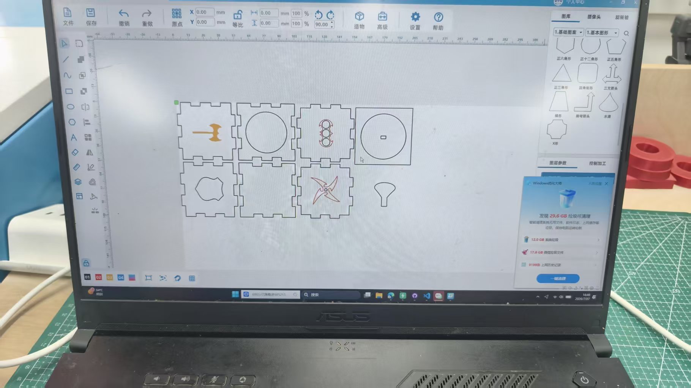
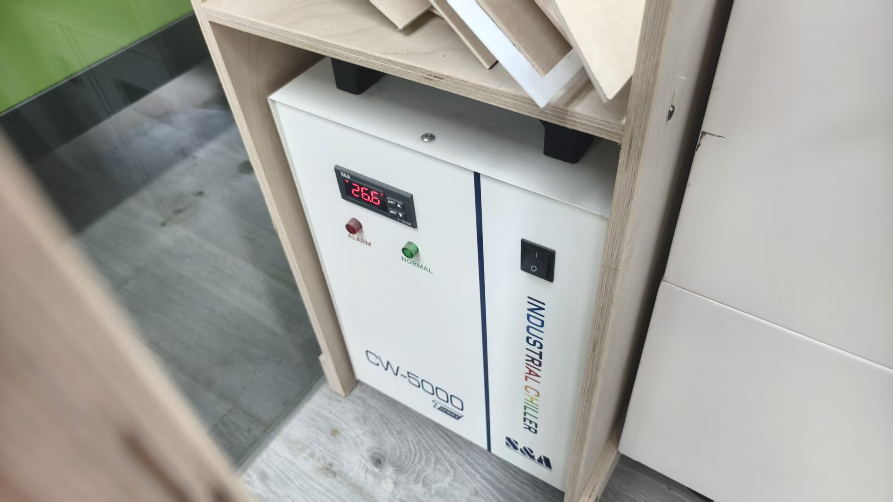
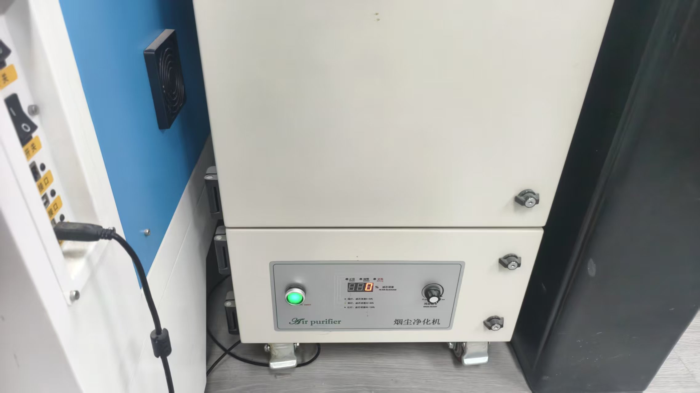
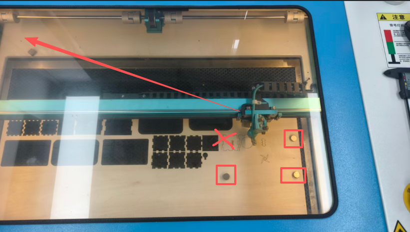
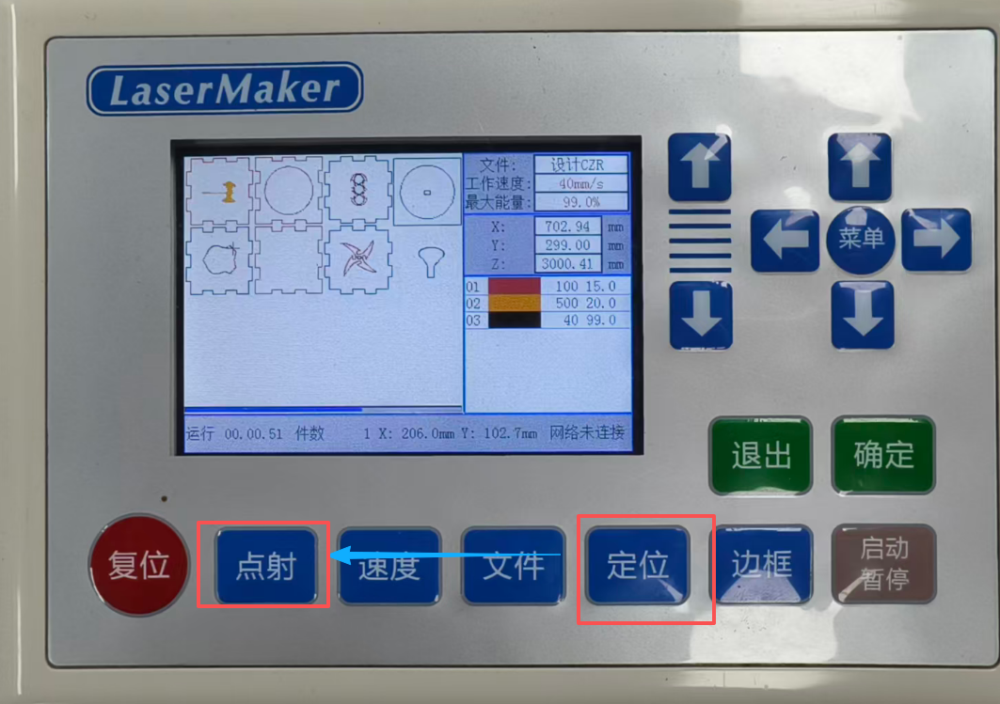
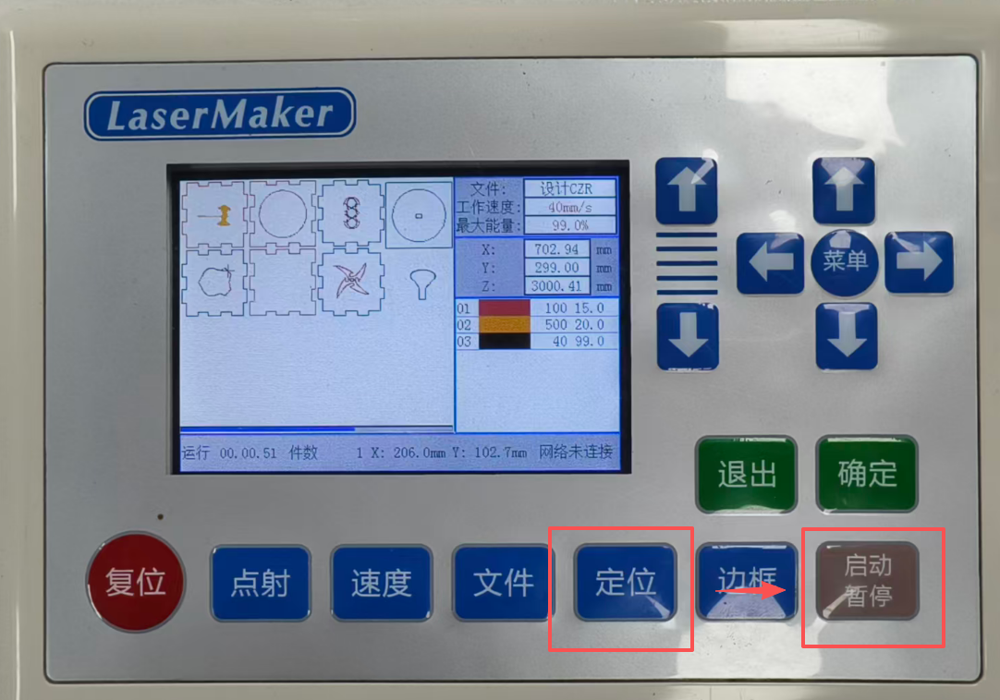
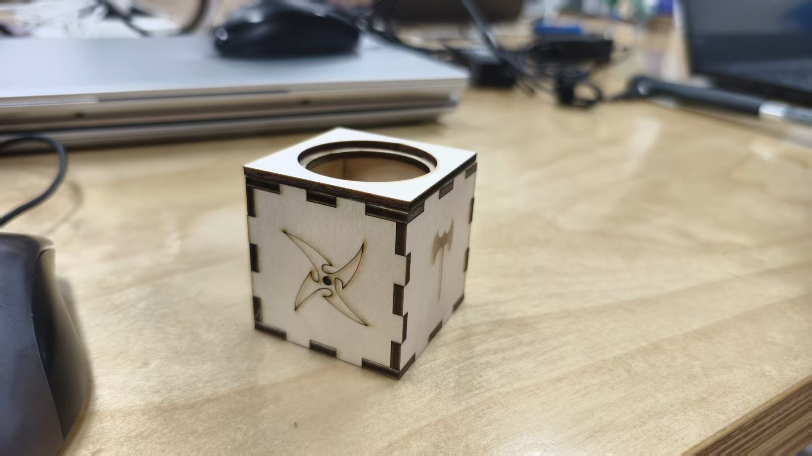

# Learning

## 1.Laser Cutter Operation

* Concept: What is a Laser Cutting Machine?  
A laser cutter is a precision manufacturing machine that uses a focused, high-powered laser beam to cut, melt, or vaporize materials. It's a type of computer-controlled cutting and is a subtractive manufacturing process, meaning it removes material to create the desired shape.

The word LASER is an acronym for Light Amplification by Stimulated Emission of Radiation

How Does It Work?

Step 1: Drawing Basic Shapes
After opening LaserMaker, you will find the Drawing Toolbox on the left side. This contains the most frequently used tools.* Overview of Git  

Step 2: Connect the device and verify that the cooling water tank is functioning. The water tank provides cooling to ensure the machine operates properly under high‑temperature conditions.

  

Step 3: Ensure that the fume extractor is working properly to prevent the machine from being contaminated by smoke and dust.

  

Step 4: Place weights on the material to hold it flat, but do not place anything on the top‑left corner, because the laser head will return to that position during homing and could collide with any obstruction.

 

Step 5: Use the control panel. First, set the origin position – make sure it is at the top‑left corner. If you are unsure about the exact spot, you can use the pulse (or test fire) function to verify.

 

Step 6: Confirm the cutting boundary (frame) to ensure that the laser will not cut into empty space or damage other areas. Once verified, you can start the cutting process.

 

This is the finished product I made!!!

 

The above is what I learned on Day 4.

thanks!

## 2.COMPUTER NUMERICAL CONTROL (CNC)  

Concept: What is a computer numerical control(CNC)
It is a way of using computers to control machines that cut, carve, or shape materials. First, you design a part on a computer using CAD software. Then, you use CAM software to turn that design into a set of instructions called G‑code. The machine reads the G‑code and moves its tools automatically to make your design in real material. Common CNC machines include mills, routers, and laser cutters. In Fab Academy, we use CNC for making circuit boards, wooden structures, and many other projects.

Step 1: Use Autodesk Fusion 360 to create a 3D model of the part you intend to cut. During the modeling process, generate the necessary sketches, project them onto the appropriate planes, and finally export the file (as a DXF format) for further processing.

Step2: Verify that the cooling water tank of the CNC machine is operational. This cooling system circulates water to dissipate the heat produced during cutting and milling, preventing the spindle and tool from overheating and ensuring stable performance.

Step 3: Secure the wooden workpiece onto the CNC bed using the vacuum pump system. The vacuum suction will firmly hold the material flat, preventing any warping, lifting, or movement during cutting, which is essential for maintaining precision and avoiding tool breakage.

Step 4: Determine the zero point (origin) for the Z‑axis by carefully lowering the cutting tool until its tip makes light contact with the top surface of the wooden board. To confirm the exact contact point, you may gently rotate the tool bit by hand – when it can no longer turn freely, you know it has reached the surface. Once the reference point is set, open the dust extraction hose to start removing chips and dust during the cutting process.

Step 5: Close the safety door of the CNC machine. Because the machine operates with high‑speed rotating tools, it poses a serious risk to operators; always make sure that no one is inside the working area. Then power on the machine and start the cutting program. After the machining is complete and the tool has stopped, remove the workpiece and use sandpaper to sand the edges and surfaces for a smooth finish.

I completed a desktop display sign as my first finished piece. Thank you!