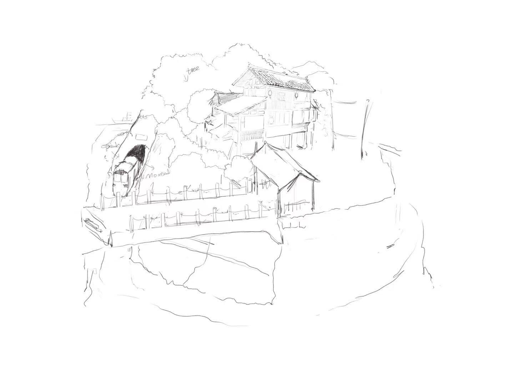

# 1. Foundation Skills & Project Kick‑off

## Assignment
* Concept: I aim to create a cozy miniature village featuring traditional Miao-style houses, a vintage open-air cinema (with a working screen), and a train that automatically stops at the station. At night, warm yellow lights illuminate the entire scene, creating a nostalgic and inviting atmosphere.

Technologies: 3D printing, laser cutting, embedded programming (custom PCB), sensor integration (proximity/magnetic switches for train stopping), PWM-controlled LED lighting, and OLED display for the cinema.

Over the past week, my primary efforts have been dedicated to establishing my GitHub repository and acquiring foundational knowledge in 3D modeling. In addition, I have preliminarily completed a conceptual design drawing. The design concept encompasses traditional Chinese Miao‑style vernacular architecture, integrated with a post‑industrial era steam train capable of stopping at a railway station, alongside a vintage open‑air cinema representative of modern China. These elements are brought together as a cohesive overall presentation.

 

## Technologies Required
1.Traditional Miao‑style houses:

Implementation Technology:3D printing or laser‑cut wooden panels assembled; roofs can be made with multiple stacked layers to imitate tile effects

Corresponding Fab Skill Module:3D design, additive manufacturing

2:Train circling the village:

Implementation Technology:Driven by a small DC motor + gear set; track laser‑cut into a circular or elliptical shape

Corresponding Fab Skill:ModuleComputer‑controlled cutting, mechanical transmission

3:Train stopping at the station:

Implementation Technology:Install a reed switch or infrared sensor on the track, and attach a magnet or vane under the train. When triggered, the train decelerates and stops, then restarts after a delay

Corresponding Fab Skill Module:Sensor input, embedded programming

4.Vintage open‑air cinema (with playback):

Implementation TechnologyUse a small OLED screen or LED dot‑matrix display embedded in a wooden frame that mimics a movie screen. Loop a simple animation (e.g., old film clips or pixel‑art scenes)

Corresponding Fab Skill Module:Embedded programming, output control

